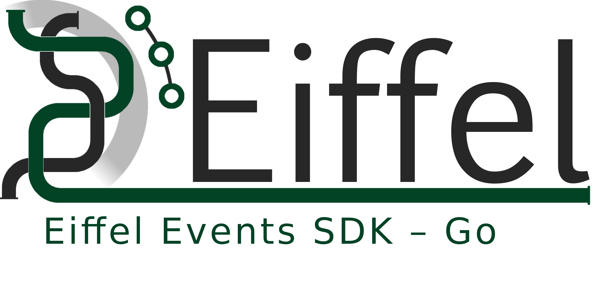

<!---
   Copyright Axis Communications AB
   For a full list of individual contributors, please see the commit history.

   Licensed under the Apache License, Version 2.0 (the "License");
   you may not use this file except in compliance with the License.
   You may obtain a copy of the License at

       http://www.apache.org/licenses/LICENSE-2.0

   Unless required by applicable law or agreed to in writing, software
   distributed under the License is distributed on an "AS IS" BASIS,
   WITHOUT WARRANTIES OR CONDITIONS OF ANY KIND, either express or implied.
   See the License for the specific language governing permissions and
   limitations under the License.
--->



[](https://github.com/eiffel-community/community/blob/master/PROJECT_LIFECYCLE.md#stage-sandbox)

# Eiffel Events SDK – Go
This repository contains data types, constants, and functions for working with Eiffel events in the [Go](https://golang.org/) language, including serialization to and from JSON. Its goal is to make it easy to create and process Eiffel events in Go.

The module declares a Go struct for every major version of each event type.
These structs are generated from the JSON schemas and named as in the example
below.

```go
package main

import (
	"fmt"
	"time"

	"github.com/eiffel-community/eiffelevents-sdk-go"
)

func main() {
	// Manual initialization of all struct members.
	var event1 eiffelevents.CompositionDefinedV3
	event1.Meta.Type = "EiffelCompositionDefinedEvent"
	event1.Meta.Version = "3.2.0"
	event1.Meta.ID = "87dac043-2e1b-41c5-833a-712833f2a613"
	event1.Meta.Time = time.Now().UnixMilli()
	event1.Data.Name = "my-composition"
	fmt.Println(event1.String())

	// Equivalent example using the factory function that pre-populates all
	// required meta members (picking the most recent event version in
	// the chosen major version). Note that the factory function returns
	// a struct pointer.
	event2, err := eiffelevents.NewCompositionDefinedV3()
	if err != nil {
		panic(err)
	}
	event2.Data.Name = "my-composition"
	fmt.Println(event2.String())
}
```

To unmarshal a JSON string into one of these structs use the UnmarshalAny
function and use e.g. a type switch to access the event members:

```go
package main

import (
	"fmt"
	"io"
	"os"

	"github.com/eiffel-community/eiffelevents-sdk-go"
)

func main() {
	input, err := io.ReadAll(os.Stdin)
	if err != nil {
		panic(err)
	}

	anyEvent, err := eiffelevents.UnmarshalAny(input)
	if err != nil {
		panic(err)
	}

	switch event := anyEvent.(type) {
	case *eiffelevents.CompositionDefinedV3:
		fmt.Printf("Received %s composition\n", event.Data.Name)
	default:
		fmt.Printf("This event I don't know much about: %s\n", event)
	}
}
```

## Code of Conduct and Contributing
To get involved, please see [Code of Conduct](https://github.com/eiffel-community/.github/blob/master/CODE_OF_CONDUCT.md) and [contribution guidelines](https://github.com/eiffel-community/.github/blob/master/CONTRIBUTING.md).

Note that these files are located in the .github repository. See [this](https://docs.github.com/en/github/building-a-strong-community/creating-a-default-community-health-file) page for further details regarding default community health files.

## About this repository
The contents of this repository are licensed under the [Apache License 2.0](./LICENSE).

## About Eiffel
This repository forms part of the Eiffel Community. Eiffel is a protocol for technology agnostic machine-to-machine communication in continuous integration and delivery pipelines, aimed at securing scalability, flexibility and traceability. Eiffel is based on the concept of decentralized real time messaging, both to drive the continuous integration and delivery system and to document it.

Visit [Eiffel Community](https://eiffel-community.github.io) to get started and get involved.
